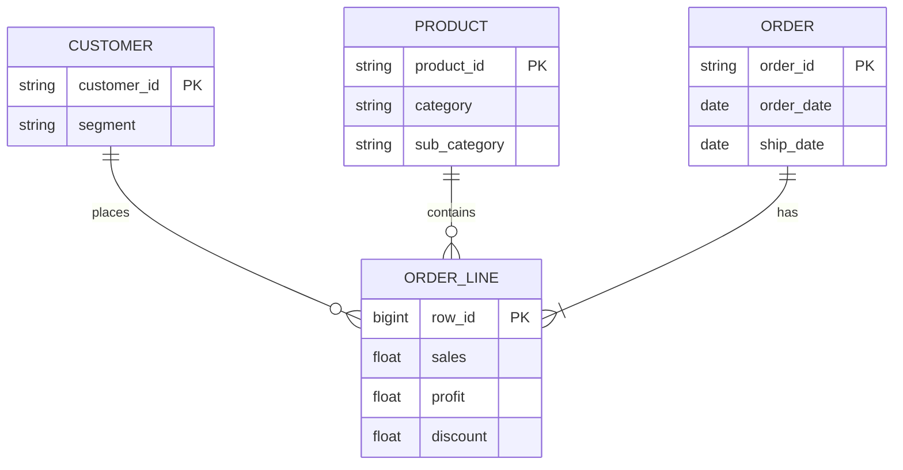

# Модель данных

## Витрина `mart_region_year`

| Поле | Тип | Смысл |
|------|-----|--------|
| region, country, year | измерения | |
| order_lines | count | число строк |
| revenue, profit | sum | метрики |
| margin | ratio | profit / revenue |

SQL: `sql/duckdb/analytics.sql`, `sql/postgres/init.sql`.
