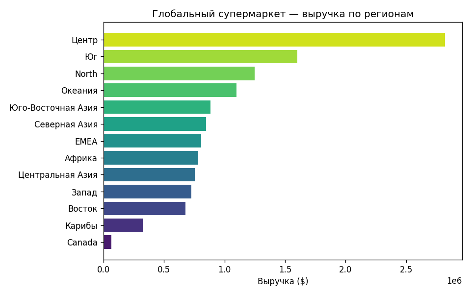
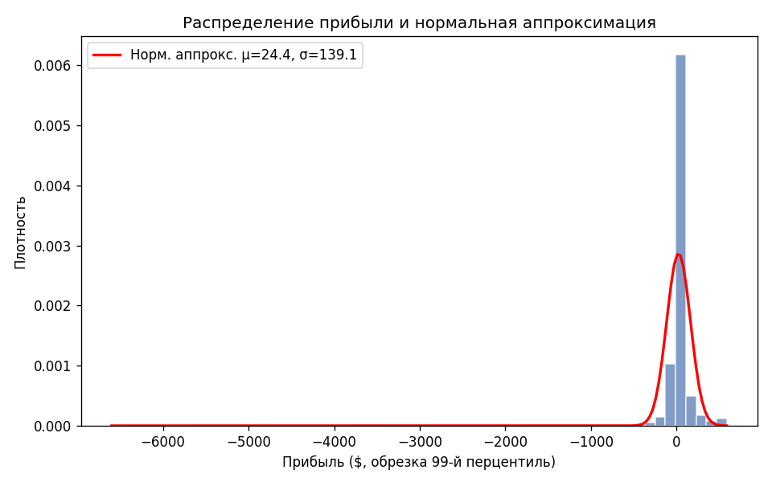
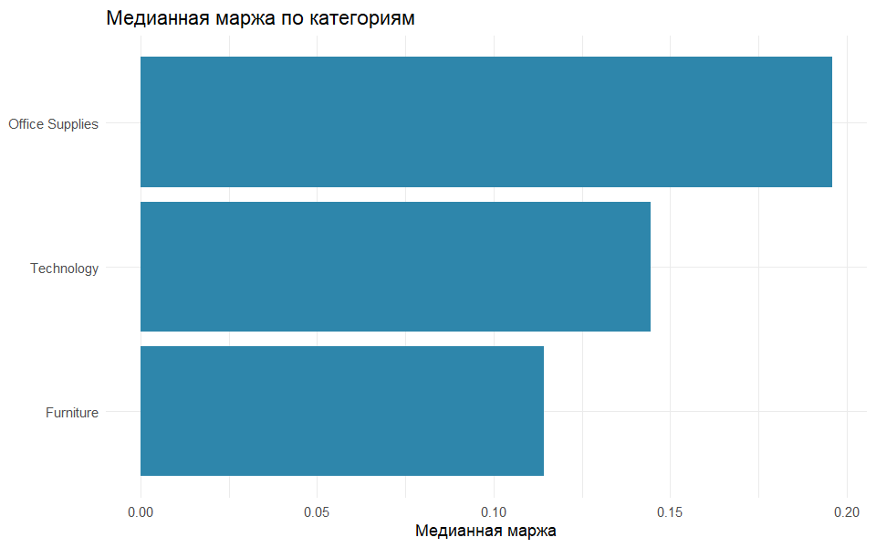

# Результаты анализа Global Superstore

Данные: 51 289 строк заказов после очистки (2011–2014).  
Источник: выгрузка Global Superstore.

## Сводка

| Показатель | Значение |
|------------|----------|
| Средний чек (sales) | ~246 $ |
| Средняя прибыль на строку | ~29 $ |
| Средняя скидка | ~14 % |
| Регионов в данных | 13 |

## Прибыль по категориям

| Категория | Прибыль, $ |
|-----------|------------|
| Технологии | 663 779 |
| Канцтовары | 518 474 |
| Мебель | 285 205 |

## Графики

### Выручка по регионам

### Распределение прибыли

### Маржа по категориям (R)

## Статистика (кратко)

**Скидка и прибыль** — t-критерий Уэлча между заказами без скидки и со скидкой: различие значимо (p ≪ 0.05). Это не доказательство причинности, только разведочный тест.

**Регрессия** выручки на количество, скидку и доставку: R² ≈ 0.60. Количество товара увеличивает sales, скидка — снижает.

**PCA** по профилям сегментов (Consumer / Corporate / Home Office): первые 2 компоненты объясняют ~100 % дисперсии агрегированных KPI (3 сегмента).

## Качество данных

В сыром CSV поля дат часто битые (`00:00.0`). В ETL даты восстанавливаются из `year`, `weeknum` и года в `order_id`. Подробности — в `superstore/etl/load_and_clean.py`.

## Дашборд

Интерактивные срезы — в [dashboard/README.md](../dashboard/README.md). На GitHub доступны только статические материалы из этой папки.
